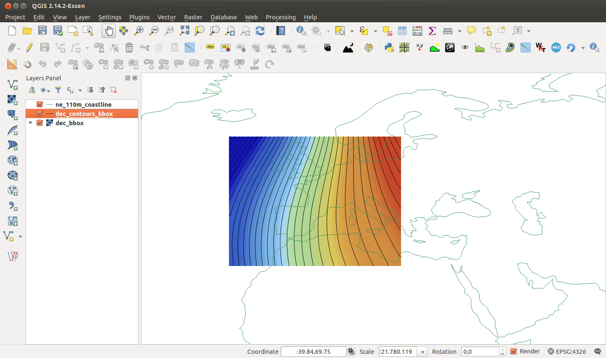

# Declination map
Computing declination data from World Magnetic Model for entire world or for a given bounding box.
Outputs are GIS files: raster (GeoTiff) and vector (Shapefile).

The World Magnetic Model (WMM) is produced for the U.S. and U.K. defense agencies with guaranteed quality, user support, and updates. The WMM is a predictive-only model and is valid for the current epoch, 2014-2019. WMM model details: http://ngdc.noaa.gov/geomag/WMM.

# Usage examples
```python
from datetime import date
from decmap import DecMap

out_vector = "/tmp/decmaps_testbbox/dec_contours_bbox.shp"
out_raster = "/tmp/decmaps_testbbox/dec_bbox.tif"

#(Maximum latitude, Maximum Longitude, Minimum latitude, Minimum longitude)
bbox = (60., 20., 30, -20.)
sp_rst = 2
time = date(2018, 1, 1)

decmap = DecMap(bbox, sp_rst)
decmap.build(out_raster, out_vector, time=time, ct_itv=.5)

```
Results (raster and vector layer):


More info: See test_decmap.py and test_matplotlib.py.

## About author
Developed by Cayetano Benavent.
GIS Analyst at Geographica.

http://www.geographica.gs

## License
This program is free software; you can redistribute it and/or modify
it under the terms of the GNU General Public License as published by
the Free Software Foundation; either version 2 of the License, or
(at your option) any later version.
